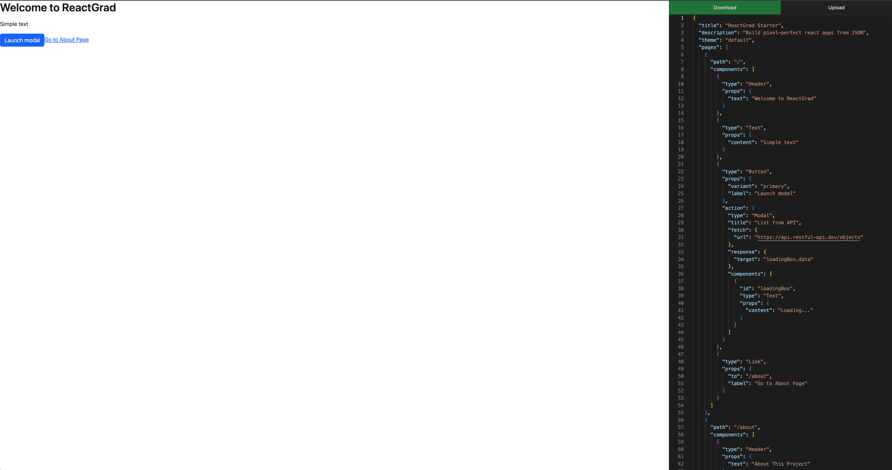

# 🚀 Reactgrad starter

A modern monorepo boilerplate for rapidly building internal business web apps using **React**, **TypeScript**, **Vite**, **pnpm**, and **Turborepo**.

Ideal for onboarding grad-level engineers into building pixel-perfect apps driven by a JSON schema.

## 📚 On this page:

- 🧱 [Tech stack](#-tech-stack)
- 📁 [Project structure](#-project-structure) 
- 🛠️ [Development commands](#️-development-commands)
- 🚀 [Quick start](#-quick-start)
- 📖 [Documentation](#-documentation)

---

## 🧱 Tech stack

| Tool             | Purpose                                   |
|------------------|--------------------------------------------|
| [React](https://react.dev/) | UI framework |
| [TypeScript](https://www.typescriptlang.org/) | Type safety |
| [Vite](https://vitejs.dev/) | Lightning-fast dev server & bundler |
| [pnpm](https://pnpm.io/) | Monorepo-friendly package manager |
| [Turborepo](https://turbo.build/repo) | Task orchestration across apps/packages |

---

## 📁 Project structure

```
reactgrad-dev/
├── 📱 apps/
│   └── reactgrad-csr/          # Client-side React application
├── 📦 packages/
│   ├── ui/                     # Shared UI components & themes
│   ├── schema/                 # JSON configuration schemas
│   └── renderer/               # Schema-to-component renderer
├── ⚙️  turbo.json              # Turborepo build pipeline
├── 📋 pnpm-workspace.yaml      # Workspace configuration
└── 📄 package.json             # Root dependencies
```

## 🛠️ Development commands

| Command | Description |
|---------|-------------|
| `pnpm gen` | 🆕 Generate a new application |
| `pnpm build:config` | 🔧 Build configuration schema |
| `pnpm dev:editor` | 🚀 Start development server with in-page JSON editor |
| `pnpm dev` | 🚀 Start development server |
| `pnpm test:ui` | ✅ Run UI component tests |
| `pnpm build` | 📦 Build all packages |
| `pnpm lint` | 🔍 Lint all code |

## 🚀 Quick start

```bash
# Install dependencies
pnpm install

# Start development
pnpm dev 

# Start development + run embedded JSON editor in browser
pnpm dev:editor 

# Run tests
pnpm test
```

## 🛠️ In-page editor


## 📖 Documentation

- **[Development Patterns](./PATTERNS.md)** - Coding standards, theme architecture, and best practices
- **Component Library** - Browse available UI components in `/packages/ui/src/components`
- **Theme System** - Multi-theme support for Bootstrap and Tailwind CSS